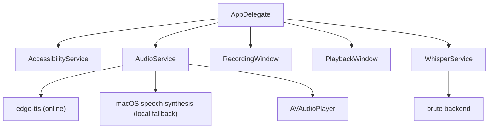

# Parselton - Speech To Text & Text To Speech

<p align="center">
  
</p>

Native macOS application for system-wide speech-to-text and text-to-speech conversion.
Must have [brute agent](https://github.com/A2gent/brute) running locally.

## Features
- Automatic speech-to-text capture and automatic paste into any focused input with keyboard press (F12)
  - **Floating recording window** with live waveform visualization
- Automatic text-to-speech generation of currently selectect text with a keyboard press (also F12)
  - **Floating playback window** for text-to-speech with stop, pause, and seek controls
- Brute AI agent session creation from speech with a keyboard press(F11)
- **Smart context detection:**
  - Text selected → Text-to-Speech (plays audio)
  - No selection → Speech-to-Text (records audio, transcribes, pastes result)
- **Menu bar presence** with settings window
  - **Selectable TTS engines** in Settings: automatic, native macOS speech, and `edge-tts`


## Requirements

- macOS 13.0+
- Xcode 14.0+
- Microphone permissions
- Accessibility permissions (for global shortcuts and text insertion)
- Optional: `edge-tts` in `PATH` or a common local install location for higher-quality online TTS
## Quick Start

1. **Start the backend** (required for speech-to-text):
   ```bash
   ./scripts/start-backend.sh
   ```

2. **Open in Xcode**:
   ```bash
   open parselton.xcodeproj
   ```

3. **Build and Run** (`Cmd+R` in Xcode)

4. **Grant permissions** when prompted:
   - Microphone access
   - Accessibility access

5. **Open Settings** and confirm the backend URL if needed.

6. **Test it**:
   - Select any text → Press F12 → Listen to speech
   - No selection → Press F12 → Speak → Press F12 again → Text pasted
   - Press F11 → Speak → Press F11 again → New brute session starts from the transcript

## Setup

### Backend Setup

Parselton depends on the [A2gent brute backend](https://github.com/A2gent/brute) for Whisper transcription. Speech-to-text will not work unless that service is running.

```bash
cd ~/git/a2gent/brute
make run
```

Or use the helper script:
```bash
./scripts/start-backend.sh
```

Default transcription endpoint:
```text
http://localhost:5445/speech/transcribe
```

Test the endpoint:
```bash
./scripts/test-whisper.sh
```

### Text-to-Speech Privacy

Parselton supports:

- `edge-tts` for higher-quality voices via Microsoft online TTS
- native macOS speech synthesis as a local fallback

When `edge-tts` is selected or used by the automatic engine, the selected text is sent to Microsoft's online text-to-speech service to generate audio. If you prefer local-only speech synthesis, choose the native macOS voice option in Settings.

## Architecture

- **Swift + AppKit** for native macOS experience
- **AVFoundation** for audio recording and playback
- **Carbon** for global keyboard shortcuts
- **Accessibility API** for text selection detection and insertion
- **brute** backend integration for speech-to-text



## Usage

1. Click menu bar icon to configure settings
2. Press configured shortcut:
   - **With text selected:** Converts text to speech and plays audio
   - **Without selection:** Opens recording window
3. While recording, press shortcut again to stop and transcribe
4. Transcribed text is automatically pasted at cursor position
5. Use the brute session shortcut to record a fresh prompt and send it straight into a new brute session

## License

Private project
