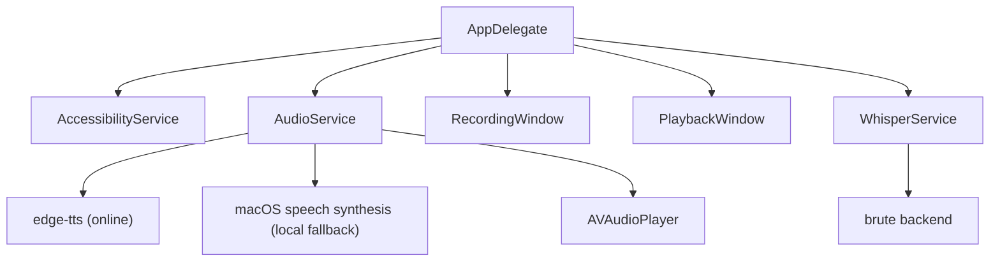

# adapter-mac - Speech To Text & Text To Speech

<p align="center">
  
</p>

Native macOS application for system-wide speech-to-text and text-to-speech conversion.
Must have [brute agent](https://github.com/A2gent/brute) running locally.

## Features
- Automatic speech-to-text capture and automatic paste into any focused input with keyboard press (F12)
  - **Floating recording window** with live waveform visualization
  - **Recording reliability safeguards** for Bluetooth and Continuity microphones, plus short or empty capture detection before transcription
- Automatic text-to-speech generation of currently selectect text with a keyboard press (also F12)
  - **Floating playback window** for text-to-speech with stop, pause, and seek controls
- Brute AI agent session creation from speech with a keyboard press (F11)
  - Sends the transcript immediately to **Knowledge Base**, with an automatic screenshot of the display under the pointer
  - Opens the created session in Caesar; errors preserve the transcript as a recoverable draft
- **New session with screen context** in Settings (or Cmd+N while the app is active)
  - Explicit project selection, editable message, automatic screenshot preview
  - Pen, arrow and rectangle annotations, Undo/Clear, recapture and attachment removal
  - Works with desktop apps and games, not only browser pages
- **Smart context detection:**
  - Text selected -> Text-to-Speech (plays audio)
  - No selection -> Speech-to-Text (records audio, transcribes, pastes result)
- **Menu bar presence** with a dedicated, resizable settings window (no dropdown)
  - **Selectable microphones** with clearer labels for built-in, external, Bluetooth, and iPhone Continuity inputs
  - **Selectable TTS engines** in Settings: automatic, native macOS speech, and `edge-tts`

## Requirements

- macOS 14.0+
- Xcode 14.0+
- Microphone permissions
- Accessibility permissions (for global shortcuts and text insertion)
- Screen Recording permission for optional display context
- Optional: `edge-tts` in `PATH` or a common local install location for higher-quality online TTS
## Quick Start

1. **Start the backend** (required for speech-to-text):
   ```bash
   ./scripts/start-backend.sh
   ```

2. **Open in Xcode**:
   ```bash
   open adapter-mac.xcodeproj
   ```

3. **Build and Run** (`Cmd+R` in Xcode)

4. **Grant permissions** when prompted:
   - Microphone access
   - Accessibility access

5. **Click the A²gent menu bar icon** to open Settings. Choose **Audio & speech** to configure your microphone, transcription provider, backend URL, and TTS engine.

6. **Test it**:
   - Select any text → Press F12 → Listen to speech
   - No selection → Press F12 → Speak → Press F12 again → Text pasted
   - Press F11 → Speak → Press F11 again → New brute session starts from the transcript

## Setup

### Backend Setup

adapter-mac depends on the [A2gent brute backend](https://github.com/A2gent/brute) for Whisper transcription. Speech-to-text will not work unless that service is running.

```bash
cd ~/git/a2gent/brute
make run
```

Or use the helper script:
```bash
./scripts/start-backend.sh
```

Default transcription endpoint:
```text
http://localhost:5445/speech/transcribe
```

Test the endpoint:
```bash
./scripts/test-whisper.sh
```

### Text-to-Speech Privacy

adapter-mac supports:

- `edge-tts` for higher-quality voices via Microsoft online TTS
- native macOS speech synthesis as a local fallback

When `edge-tts` is selected or used by the automatic engine, the selected text is sent to Microsoft's online text-to-speech service to generate audio. If you prefer local-only speech synthesis, choose the native macOS voice option in Settings.

## Architecture

- **Swift + AppKit + SwiftUI** for a native, nonmodal settings window
- **Local WebKit/Three.js** for the same blue faceted sphere used in Caesar (no network requests)
- **AVFoundation** for audio recording and playback
- **Carbon** for global keyboard shortcuts
- **Accessibility API** for text selection detection and insertion
- **brute** backend integration for speech-to-text


```mermaid
flowchart TD
    AD["AppDelegate"] --> AX["AccessibilityService"]
    AD --> AS["AudioService"]
    AD --> RW["RecordingWindow"]
    AD --> PW["PlaybackWindow"]
    AD --> WS["WhisperService"]

    AS --> EDGE["edge-tts (online)"]
    AS --> NSS["macOS speech synthesis (local fallback)"]
    AS --> PLAYER["AVAudioPlayer"]

    WS --> BRUTE["brute backend"]
```

## Usage

1. Click the A²gent menu bar icon to open the compact voice conversation with the sphere and session controls. The gear expands the same window into Settings; Conversation collapses it again. Cmd+, opens Settings directly. Overview contains recording/playback controls and Quit; Audio & speech and Shortcuts contain configuration. Save changes applies the draft; Cancel or closing the window discards unsaved settings. Expanding, collapsing, hiding and repeated tray clicks preserve edits. Closing and reopening reuses the window with saved settings.
2. Press configured shortcut:
   - **With text selected:** Converts text to speech and plays audio
   - **Without selection:** Opens recording window

## Recording reliability notes

- Recordings are still written as `m4a` AAC files. This stays compatible with the current brute HTTP uploader and the future local transcription provider.
- Before transcription, adapter-mac now rejects recordings that are effectively empty, too short to be intentional, or contain no speech-like waveform activity.
- Bluetooth and iPhone Continuity microphones are surfaced more clearly in Settings and the floating recording HUD because those inputs are more likely to disconnect or switch unexpectedly on macOS.
3. While recording in toggle mode, press the shortcut again to stop and transcribe
4. In hold-to-record mode, keep the adapter-mac shortcut held while speaking and release it to stop
5. Press Escape while recording or playback to cancel immediately
6. Transcribed text is automatically pasted at cursor position
7. Use the brute session shortcut to record a fresh prompt and send it straight into a new brute session

## License

Private project

## Session creation and screen privacy

- **Voice (F11):** recording starts an automatic single-frame capture of the display under the pointer. Stopping sends the nonempty transcript as `task`, explicitly binds `project_id` to Knowledge Base, and includes the screenshot. There is no confirmation step. Ordinary F12 dictation/read-aloud does **not** capture the screen.
- **Manual:** open Settings → **New session with screen context**. The adapter hides itself, captures the current display, then shows a composer. Select a project, enter the task, and optionally draw on or remove the screenshot before creating the session (Cmd+Return).
- ScreenCaptureKit excludes the adapter's own windows. Other visible windows on the selected display are included: avoid showing secrets when starting a voice session. No continuous screen recording, system-audio capture, or remote window control is enabled by this feature.
- Screen Recording permission is requested on first capture. If declined, voice still sends the transcript and reports the missing screenshot; manual sessions can be sent without an attachment. Enable permission in macOS Privacy & Security to retry (macOS may require restarting the app).
- A screenshot is kept in memory, downscaled to a maximum edge of 2560 pixels, and sent as PNG using the same `images` payload as adapter-chrome. Drawings are burned into the image. Images over the backend's 8 MiB limit are rejected before submission.
- Both flows use Brute's serial queue, so the first message and images are persisted and the session is scheduled to run. A missing Knowledge Base, invalid/empty task, invalid project, or HTTP error is not reported as success.
- Failed POSTs are not retried automatically: check Caesar before retrying after a connection interruption to avoid duplicates. Closing the composer retains its draft in memory; use **Discard** to clear it. Failed voice drafts are kept separately from manual drafts. Drafts do not survive quitting the app.
- The session API base URL is derived from the saved transcription endpoint, including when using local transcription. Results open at `https://my.a2gent.net/#/chat/<id>`.

### Decisions for this change

The user chose direct audio-to-session submission and automatic screen capture. Voice defaults to Knowledge Base; manual sessions require explicit project selection. The previously created empty session is left unchanged: the old client omitted `project_id` and sent an unsupported `prompt` field, so the backend stored no initial message to recover.

## Local background voice conversations

Open **Settings > Voice conversation**, enable **Listen while the app is running**, set the **Agent name / wake phrase**, and Save. The default name is **Brute**; previously saved names are preserved. Command and Reply settings have separate cards. Listening is opt-in; **Speak agent replies** is enabled by default and uses local macOS system voices independently of the F12 TTS engine.

Model setup shows download bytes/percent when available and distinct cache-loading / VAD-compilation stages otherwise. **Cancel loading** stops setup; **Retry** explicitly retries after cancellation or failure. Cached models are reused. Saving unchanged voice settings does not restart listening or download models. Changing the microphone or voice settings reapplies listening configuration.

The Russian examples below use a custom agent name of `Цезарь`; substitute your configured wake phrase.

- Say the name before **every** command: `Цезарь, проверь тесты, приём`.
- Activation shows the existing blue sphere and plays a short local Tink cue. A dot in the menu bar indicates the armed microphone; the tooltip and Settings show readiness/errors.
- Finish with a configured suffix (`приём`, `конец команды` by default), the Send button, or 1.5 seconds without detected speech (adjustable 0.5–30 seconds). The old unversioned 10-second default migrates to 1.5 seconds; other saved delays are preserved. A newly saved explicit 10-second delay is preserved too. Send waits until pending audio has been recognized.
- `Цезарь, новая сессия, приём` starts a fresh context for the next command. `Цезарь, новая сессия, проверь память, приём` immediately submits to a new context. `Цезарь, отмена` discards the active utterance. Reset without a task is rejected while the current backend turn is running; a new-session task can be queued.
- First submission creates a dedicated Knowledge Base session. Later commands reuse its ID, independent of the open Caesar tab. No screenshot or focused-app text is captured. The voice session is retained only during the current app launch.
- Commands are serialized, with at most three waiting commands/replies. The microphone pauses during local spoken replies and normal F11/F12 capture/playback. This version does not support speaking over a reply; Escape stops playback. Cancel/Hide does not cancel a task already accepted by Brute, but suppresses its eventual spoken reply.
- Recognition uses multilingual `whisper.cpp small` plus FluidAudio/Silero VAD, not cloud STT. First enable downloads approximately **500 MB** of model files from Hugging Face into Application Support. Subsequent recognition is offline. Background audio and transcripts are not logged or uploaded; only activated command text is sent to the configured Brute API (whose LLM may be remote).
- Audio is processed in RAM: a 0.5-second pre-roll, at most 15 seconds per decoding segment, and a 20-second bounded capture backlog. Capture/VAD run independently of Whisper decoding. Partial snapshots are requested after ~0.75 seconds of new audio only when the decoder is free. While it is busy, audio stays in the stream and final segments retain their order. The queue is bounded by 30 seconds of retained PCM (~1.9 MB), not four short phrases, so ordinary pauses do not exhaust it. Sustained overload still pauses capture rather than sending an incomplete command. The sphere receives microphone RMS updates every ~50 ms rather than a fixed animation level. Buffers are released/reset after stop or cancellation. Overflow pauses listening with an error rather than silently dropping commands. A command is limited to 120 seconds / 8,000 characters and is never automatically sent on reaching that limit.
- Use a **Release build** for real-time listening. The shared `adapter-mac` Xcode scheme now defaults Run / Cmd+R to Release; if an existing personal scheme still uses Debug, select Product > Scheme > Edit Scheme > Run > Info > Build Configuration > Release. SwiftPM launches need `swift run -c release`. The pinned whisper.spm uses Accelerate/CPU; Debug decoding can lag. Wake detection still depends on Whisper decoding, unlike a dedicated hardware wake-word engine. The silence deadline uses speech time rather than decoder completion time; first-session reply polling is 500 ms instead of 2 seconds. Quality depends on the microphone, pronunciation and chosen name; this is not speaker authentication.
- Network failures do not trigger automatic retries. Drafts remain visible for copying; check the linked Caesar session before resending an uncertain request. Reply monitoring stops after ten minutes, without cancelling backend execution. Structured questions requiring buttons/options must be answered in Caesar.

### Voice decisions

The user selected hybrid endpointing, activation by name on every turn, a separate voice session, an editable agent name, local recognition, and optional spoken replies enabled by default. Background screenshots are deliberately excluded. Existing F11/F12 behavior remains separate.

### Unified window and latency decisions

The user requested one default sphere/session window with expandable navigation, and faster live voice response. Settings and voice now share one native window and one voice model. Existing screenshot/session composer and F11/F12 recording windows remain separate workflows. The multilingual small model is retained to avoid trading Russian recognition quality for speed. Backend inference and tools still determine agent response time.

### Recognition backlog regression fix

A slow Debug decoder combined with a four-fragment queue could stop voice listening after several short pauses. Previews now yield to in-flight decoding, and the queue uses a retained-audio budget. On the host fixture (2.816 seconds of Russian audio), Debug decoding took 7.73 seconds versus 1.10 seconds in Release. These are decoder-only measurements, not live microphone latency. Restart the old process using the Release scheme, then choose Retry in Voice settings if recognition is paused. Do not run Debug and Release microphone listeners simultaneously.
