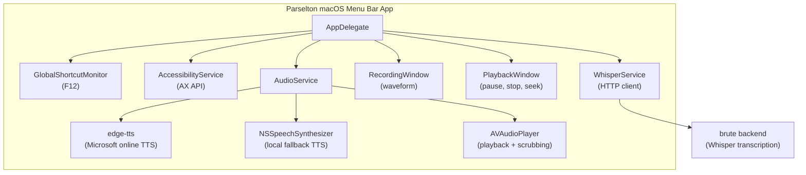

# Setup Instructions

## Building the App

1. **Open in Xcode:**
   ```bash
   cd ~/git/stts
   open parselton.xcodeproj
   ```

2. **Build and Run:**
   - Press `Cmd+R` or click the Run button
   - Xcode will compile the Swift files and launch the app

3. **Grant Permissions:**
   - **Microphone:** Required for speech-to-text recording
   - **Accessibility:** Required for:
     - Global keyboard shortcuts
     - Detecting selected text
     - Pasting transcribed text

## Backend Setup (Required for Speech-to-Text)

Parselton depends on the [A2gent brute backend](https://github.com/A2gent/brute) for Whisper transcription. Speech-to-text will not work unless that service is running.

1. **Start the backend:**
   ```bash
   cd ~/git/a2gent/brute
   make run
   ```

2. **Verify the endpoint:**
   ```bash
   curl http://localhost:5445/health
   ```

3. **Configure endpoint** (if different):
   Open app Settings and update `Backend URL`.
   Default:
   ```text
   http://localhost:5445/speech/transcribe
   ```

## Architecture Overview



## Key Files

| File | Purpose |
|------|---------|
| `AppDelegate.swift` | Main app logic, menu bar setup |
| `main.swift` | Entry point |
| `Services/GlobalShortcutMonitor.swift` | F12 keyboard shortcut via Carbon |
| `Services/AccessibilityService.swift` | Text selection & paste via AX API |
| `Services/AudioService.swift` | Recording, TTS synthesis, playback, and seek controls |
| `Services/WhisperService.swift` | HTTP client for transcription |
| `Views/RecordingWindow.swift` | Floating window with waveform |
| `Views/PlaybackWindow.swift` | Floating TTS playback controls |

## Usage Flow

### Text-to-Speech (TTS)
1. Select text in any app
2. Press F12
3. App reads selection via Accessibility API
4. Playback window appears with stop, pause, and seek controls
5. If available, `edge-tts` sends text to Microsoft's online TTS service and generates audio
6. If `edge-tts` is unavailable or fails, macOS speech synthesis generates audio locally
7. `AVAudioPlayer` plays the generated file so playback can be paused and scrubbed

### Speech-to-Text (STT)
1. Press F12 (no text selected)
2. Recording window appears with waveform
3. Speak into microphone
4. Press F12 again to stop
5. Audio sent to brute backend
6. Whisper transcribes audio
7. Text pasted at cursor via Accessibility API

## Troubleshooting

### "Microphone permission denied"
- Go to System Settings → Privacy & Security → Microphone
- Enable for "Parselton"

### "Accessibility permission denied"
- Go to System Settings → Privacy & Security → Accessibility
- Enable for "Parselton"

### "Failed to transcribe"
- Ensure the brute backend is running on `localhost:5445`
- Check backend logs for errors
- Verify audio file was created in `/tmp/`

### Global shortcut not working
- Check Accessibility permission is granted
- Try different key (edit `GlobalShortcutMonitor.swift`)
- Current keyCode `111` = F12

## Customization

### Change Keyboard Shortcut
Edit `stts/Services/GlobalShortcutMonitor.swift`:
```swift
// F12 = 111, F11 = 103, F10 = 109
registerHotKey(keyCode: 111, modifiers: 0)
```

### Change API Endpoint
Use the app Settings window and update `Backend URL`.

### Customize Waveform
Edit `stts/Views/RecordingWindow.swift`:
- Colors: HSL gradient in `draw(_:)`
- Bar count: `barCount` property
- Window size: `windowWidth` and `windowHeight`
